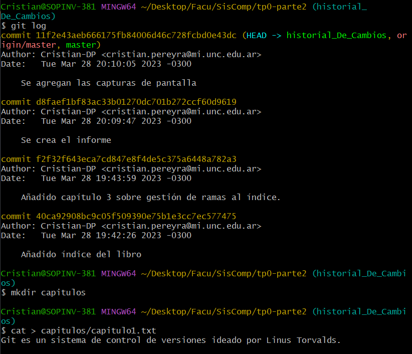
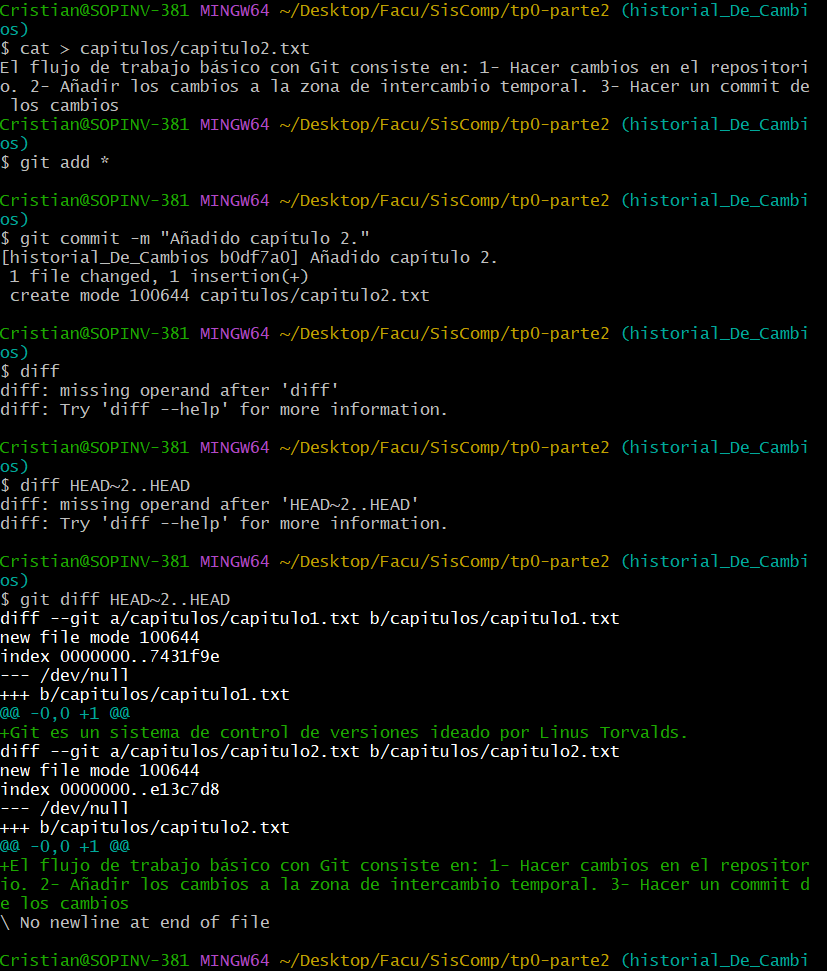
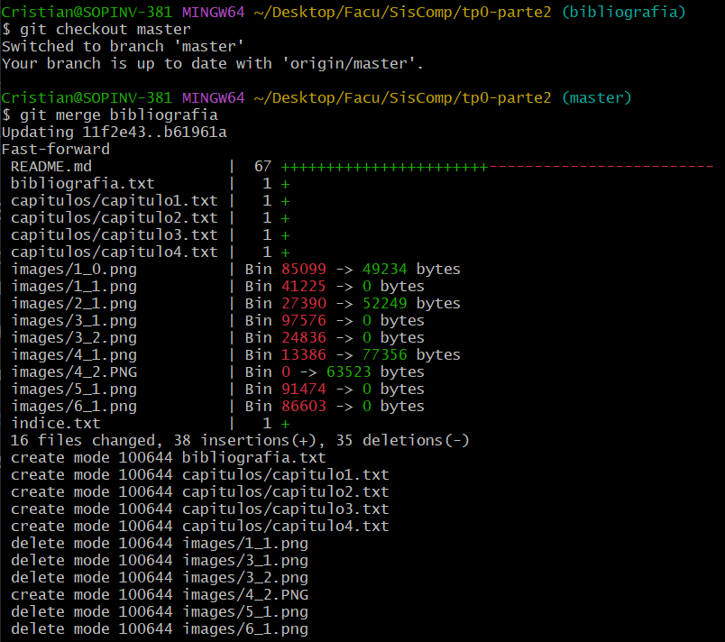

# TP0 - Parte 2 - Ejercicios 

| Version  | Fecha   | Descripción     |
| -------- | ------- | --------------- |
| 1.0      | 28-03   | Primera version |

- Estudiante
  - Cristian Pereyra
- Carrera
  - IComp
- Materia
  - Sistemas de computación
- Profesor
  - Ing. Javier Jorge
  - Mgr. Ing. Miguel Solinas

## Indice
- Enunciado
- Desarrollo
  - Ejercicios de deshacer cambios

## Enunciado
Para el objetivo 3 deberán realizar las actividades de este sitio: https://aprendeconalf.es/docencia/git/ejercicios/creacion-actualizacion-repositorios/

## Desarrollo

### Ejercicios de deshacer cambios

1. 1. Eliminar la última línea del fichero indice.txt y guardarlo.
   2. Comprobar el estado del repositorio.
   3. Deshacer los cambios realizados en el fichero indice.txt para volver a la versión anterior del fichero.
   4. Volver a comprobar el estado del repositorio.
 
   

2.  1. Eliminar la última línea del fichero indice.txt y guardarlo.
    1. Añadir los cambios a la zona de intercambio temporal.
    2. Comprobar de nuevo el estado del repositorio.
    3. Quitar los cambios de la zona de intercambio temporal, pero mantenerlos en el directorio de trabajo.
    4. Comprobar de nuevo el estado del repositorio.
    5. Deshacer los cambios realizados en el fichero indice.txt para volver a la versión anterior del fichero.
    6. Volver a comprobar el estado del repositorio.
   
   

3. 1. Eliminar la última línea del fichero indice.txt y guardarlo.
   1. Eliminar el fichero capitulos/capitulo3.txt.
   2. Añadir los cambios a la zona de intercambio temporal y hacer un commit con el mensaje “Borrado accidental.”
   3. Comprobar el historial del repositorio.
   4. Deshacer el último commit pero mantener los cambios anteriores en el directorio de trabajo y la zona de intercambio temporal.
   5. Comprobar el historial y el estado del repositorio.
   6. Volver a hacer el commit con el mismo mensaje de antes.
   7. Deshacer el último commit y los cambios anteriores del directorio de trabajo volviendo a la versión anterior del repositorio.
   8. Comprobar de nuevo el historial y el estado del repositorio.
   
4. 1. Eliminar la última línea del fichero indice.txt y guardarlo.
   1. Eliminar el fichero capitulos/capitulo3.txt.
   2. Añadir un fichero nuevo captitulos/capitulo4.txt vacío.
   3. Añadir los cambios a la zona de intercambio temporal.
   4. Comprobar de nuevo el estado del repositorio.
   5. Quitar los cambios de la zona de intercambio temporal, pero mantenerlos en el directorio de trabajo.
   6. Comprobar de nuevo el estado del repositorio.
   7. Deshacer los cambios realizados para volver a la versión del repositorio.
   8. Volver a comprobar el estado del repositorio.
   
    

