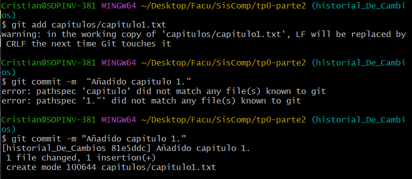
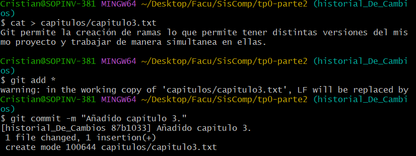
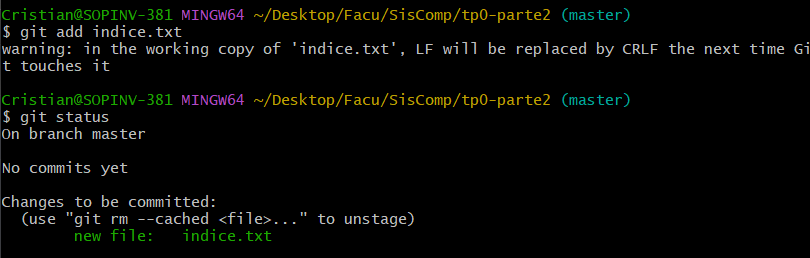
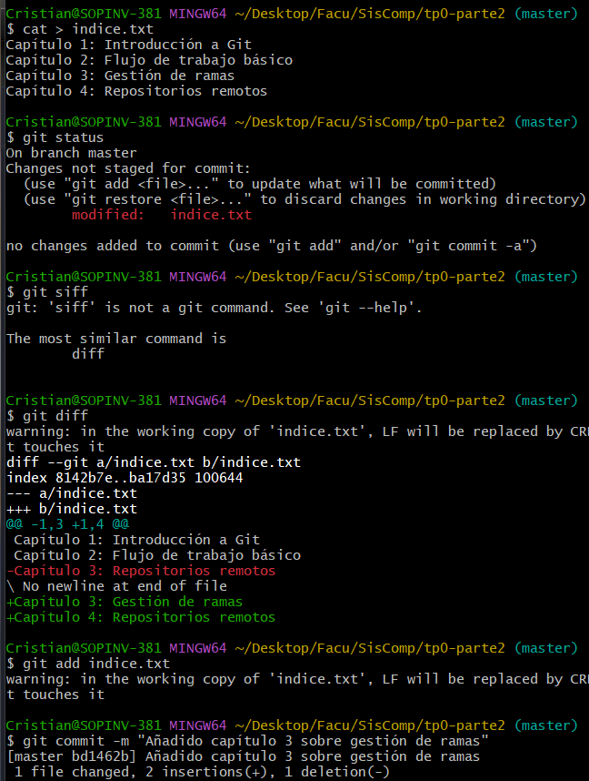
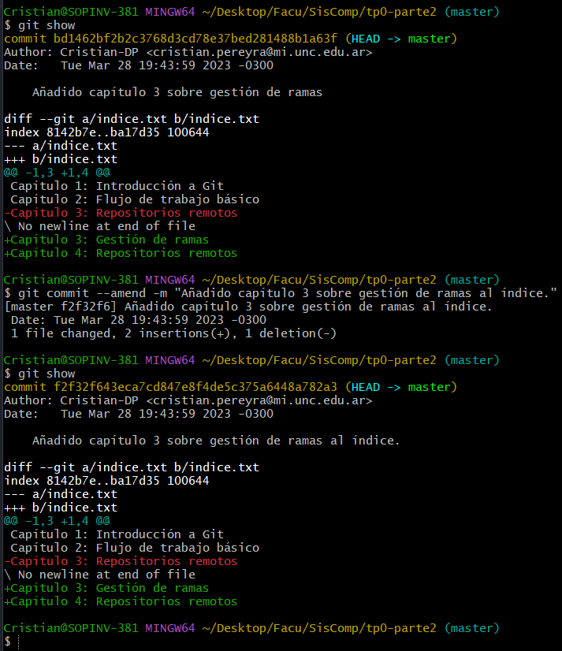

# TP0 - Parte 2 - Ejercicios 

| Version  | Fecha   | Descripción     |
| -------- | ------- | --------------- |
| 1.0      | 28-03   | Primera version |

- Estudiante
  - Cristian Pereyra
- Carrera
  - IComp
- Materia
  - Sistemas de computación
- Profesor
  - Ing. Javier Jorge
  - Mgr. Ing. Miguel Solinas

## Indice
- Enunciado
- Desarrollo
  - Primera parte
  - Segunda parte
  - Tercera parte

## Enunciado
Para el objetivo 3 deberán realizar las actividades de este sitio: https://aprendeconalf.es/docencia/git/ejercicios/creacion-actualizacion-repositorios/

## Desarrollo

### Ejercicios de creación y actualización de repositorios

1. Configurar Git definiendo el nombre del usuario, el correo electrónico y activar el coloreado de la salida. Mostrar la configuración final.
   
   
   

2. Crear un repositorio nuevo con el nombre tp0-parte2 y mostrar su contenido.
   
   

3. 1. Comprobar el estado del repositorio.
   2. Crear un fichero indice.txt con el siguiente contenido:
        Capítulo 1: Introducción a Git
        Capítulo 2: Flujo de trabajo básico
        Capítulo 3: Repositorios remotos
    3. Comprobar de nuevo el estado del repositorio.
    4. Añadir el fichero a la zona de intercambio temporal.
    5. Volver a comprobar una vez más el estado del repositorio.
   
   
   

4.  Realizar un commit de los últimos cambios con el mensaje “Añadido índice del libro.” y ver el estado del repositorio.
   
    

5.  1.  Cambiar el fichero indice.txt para que contenga lo siguiente:
        Capítulo 1: Introducción a Git
        Capítulo 2: Flujo de trabajo básico
        Capítulo 3: Gestión de ramas
        Capítulo 4: Repositorios remotos
    2.  Mostrar los cambios con respecto a la última versión guardada en el repositorio.
    3.  Hacer un commit de los cambios con el mensaje “Añadido capítulo 3 sobre gestión de ramas”.

    

6.  1. Mostrar los cambios de la última versión del repositorio con respecto a la anterior.
    2. Cambiar el mensaje del último commit por “Añadido capítulo 3 sobre gestión de ramas al índice.”
    3. Volver a mostrar los últimos cambios del repositorio.

    