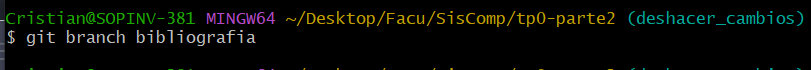
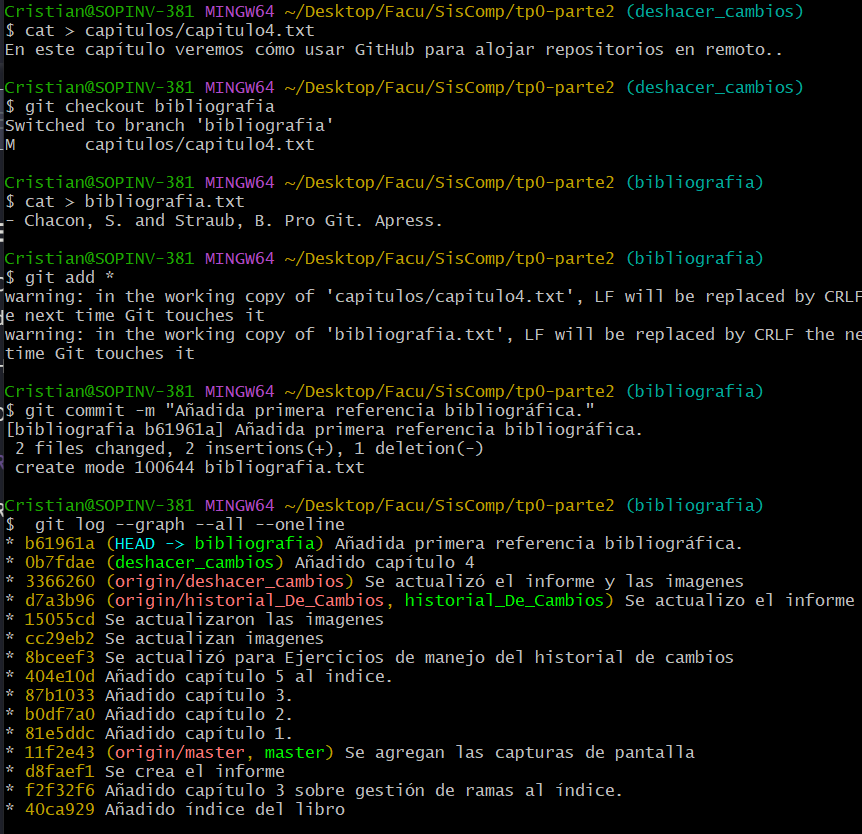

# TP0 - Parte 2 - Ejercicios 

| Version  | Fecha   | Descripción     |
| -------- | ------- | --------------- |
| 1.0      | 28-03   | Primera version |

- Estudiante
  - Cristian Pereyra
- Carrera
  - IComp
- Materia
  - Sistemas de computación
- Profesor
  - Ing. Javier Jorge
  - Mgr. Ing. Miguel Solinas

## Indice
- Enunciado
- Desarrollo
  - Ejercicios de ramas

## Enunciado
Para el objetivo 3 deberán realizar las actividades de este sitio: https://aprendeconalf.es/docencia/git/ejercicios/creacion-actualizacion-repositorios/

## Desarrollo

### Ejercicios de ramas

1. Crear una nueva rama bibliografia y mostrar las ramas del repositorio.
 
   

2.  1. Crear el fichero capitulos/capitulo4.txt y añadir el texto siguiente
        En este capítulo veremos cómo usar GitHub para alojar repositorios en remoto.
    1. Añadir los cambios a la zona de intercambio temporal.
    2. Hacer un commit con el mensaje “Añadido capítulo 4.”
    3. Mostrar la historia del repositorio incluyendo todas las ramas.
   
   

3.  1. Cambiar a la rama bibliografia.
    1. Crear el fichero bibliografia.txt y añadir la siguiente referencia
        - Chacon, S. and Straub, B. Pro Git. Apress.
    2. Añadir los cambios a la zona de intercambio temporal.
    3. Hacer un commit con el mensaje “Añadida primera referencia bibliográfica.”
    4. Mostrar la historia del repositorio incluyendo todas las ramas.
   
    

4.  1. Fusionar la rama bibliografia con la rama master.
    1. Mostrar la historia del repositorio incluyendo todas las ramas.
    2. Eliminar la rama bibliografia.
    3. Mostrar de nuevo la historia del repositorio incluyendo todas las ramas.
   
    
    
    
5.  1. Crear la rama bibliografia.
    1. Cambiar a la rama bibliografia.
    2. Cambiar el fichero bibliografia.txt para que contenga las siguientes referencias:
        - Scott Chacon and Ben Straub. Pro Git. Apress.
        - Ryan Hodson. Ry’s Git Tutorial. Smashwords (2014)
    3. Añadir los cambios a la zona de intercambio temporal y hacer un commit con el mensaje “Añadida nueva referencia bibliográfica.”
    4. Cambiar a la rama master.
    5. Cambiar el fichero bibliografia.txt para que contenga las siguientes referencias:
        - Chacon, S. and Straub, B. Pro Git. Apress.
        - Loeliger, J. and McCullough, M. Version control with Git. O’Reilly.
    6. Añadir los cambios a la zona de intercambio temporal y hacer un commit con el mensaje “Añadida nueva referencia bibliográfica.” 
    7. Fusionar la rama bibliografia con la rama master.
    8. Resolver el conflicto dejando el fichero bibliografia.txt con las referencias:
        - Chacon, S. and Straub, B. Pro Git. Apress.
        - Loeliger, J. and McCullough, M. Version control with Git. O’Reilly.
        - Hodson, R. Ry’s Git Tutorial. Smashwords (2014)
    9.  Añadir los cambios a la zona de intercambio temporal y hacer un commit con el mensaje “Resuelto conflicto de bibliografía.”
    10. Mostrar la historia del repositorio incluyendo todas las ramas.
   
    
    

